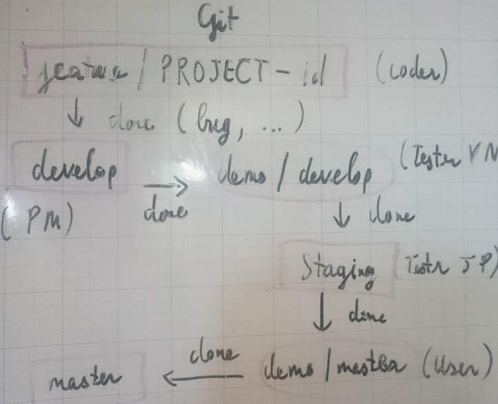

# A- Lam viec tren git bash (window) / terminal (ubuntu)
- Có 2 loại git chính là git local và git remote.
- Git local là folder .git (mở chế độ view file ẩn trên máy laptop mới có thể thấy) nằm trong máy laptop.
- Git remote là git nằm trên con server nào đó trên mạng. Mình sẽ đẩy nội dung từ local lên con server để lưu trữ.


## 1. Lam viec voi git local

* Tạo 1 folder, sau đó chuyển vào folder đó. rồi gõ 
```youtrack
    git init        # Tạo ra 1 folder .git (kho chứa) trong folder trên.
```

* Thêm các file hoặc các folder vào (các files/folders này sẽ nằm trên máy của bạn và ở dạng: untrack files)

* Thêm các files/folders vào kho git local. Lúc này chúng sẽ có cả trong kho .git và chuyển sang dạng track. 
```youtrack
    git add . 
    git add --all 
    git add file_path 
```

* Các lệnh hữu ích:
```youtrack
    git status          # Kiểm tra các files/folder trong kho git

```


* Khong them vao git (.gitignore)
	+ Dong trong hoac bat dau voi # se bo qua
	+ Regex cung hoat dong duoc (Vd: *.css, ...)
	+ Them dau / truoc moi folder muon bo di, hoac ten file binh thuong muon bo di

	
* Xem các thay đổi của các files đã commit (đã nằm trong kho) và các file mình vừa sửa đổi 
```youtrack
        git diff                ### VD:
        
	touch thieunv.txt
	
	git status                      => Untrack file: thieunv.txt (red color)
	
	gedit thieunv.txt		=> Xin chao new file.
	git add thieunv.txt
	
	git status		        => track file: thieunv.txt (green color)
	
	gedit thieunv.txt		==> Xin chao new file. Thay doi lan thu 1.
	
	git diff		        ==> Se hien ra su thay doi cua file.
```


* Chuyển stage của files sang dạng modified
```youtrack
	git commit -m "noi dung commit"
	
	git commit -a -m "noi dung commit"		// Sử dụng sau các câu lệnh add
``` 

	
* Kiem tra log	(Hien thi ra nhung commit - co ca commit cua nguoi khac nua)
```youtrack
    git log	
    git log -p -3		
        # -p : Xem luon ca nhung cai da~ thay doi: git diff
        # -3 : Xem 3 commit dau tien.
    git log --pretty=online			
        # Xem cac commit tren 1 dong`: co dang sau: hash_code change
        # --pretty: Dung de custom lai cach xem log.
```
	
		
* Thêm files vào commit trước đó mà ta quên chưa add. 
```youtrack
	git commit -m "đây là commit trước đó, ta nhận ra còn cái file mà ta chưa add vào mà đã commit."		
	git add forgotten_file
	git commit --amend          # Sẽ không phải commit lần mới.
```

	
	
##2. Làm việc với git remote (git online trên mạng)

* Tạo kho trên mạng bằng cách đăng kí tài khoản github hoặc gitlab hoặc bitbucket ...

* Tạo 1 kho trên server (Click vào : Add repository)

* Cách đơn giản khác là clone kho trên mạng của người khác về hoặc kho của mình.
```youtrack
	git clone [url]						// https://github.com/ThieuNv/bai_tap_tai_techmaster.git
										// default ten la: bai_tap_tai_techmaster
	git clone [url] ten_thu_muc			// dat ten khac trong thu muc .git		
```

* Tham chiếu kho local đến kho server (để nó có thể đồng bộ - lưu trữ)   
```youtrack
    git remote rename origin your_name_you_like
    
    git remote					// Kiem tra xem da~ co remote chua.
    
    git remote -v				// -v: version
    
    ### VD: 
    
    git clone https://github.com/ThieuNv/bai_tap_tai_techmaster.git	
    cd bai_tap_tai_techmaster
    git remote -v
        origin	https://github.com/ThieuNv/bai_tap_tai_techmaster.git (fetch)
        origin	https://github.com/ThieuNv/bai_tap_tai_techmaster.git (push)
```

* Cai alias (cách viết tắt cho các câu lệnh)
```youtrack
	git config --global alias.last 'log -1 HEAD'
	---> Khi ta go~:  git last		// No se~ ra thong tin cua cau lenh: git log -1 HEAD
``` 


##3. Các câu lệnh trong các trường hợp đặc biệt 
	
* Khi đã up files lên cả server rồi mà giờ muốn xóa đi thì: 
```youtrack
    - Thêm nó vào .gitignore    
    Vd:		node_modules/
			104_request/crawrl_website/
    
    git rm --cached -rf node_modules
	git rm --cached -rf 104_request/crawrl_website
```
- Cách 2 là làm trầy cối: Thêm nó vào .gitignore, xong xóa nó trên local, rồi commit lên server 

* Ta có thể có rất nhiều remotes trong 1 git trên server, ta có thể xóa đi bằng cách: 
```youtrack
git remote -v           # View current remotes
    origin  https://github.com/OWNER/REPOSITORY.git (fetch)
    origin  https://github.com/OWNER/REPOSITORY.git (push)
    destination  https://github.com/FORKER/REPOSITORY.git (fetch)
    destination  https://github.com/FORKER/REPOSITORY.git (push)

git remote rm destination           # Remove remote

git remote -v           # Verify it's gone
    origin  https://github.com/OWNER/REPOSITORY.git (fetch)
    origin  https://github.com/OWNER/REPOSITORY.git (push)
```
	


## 4. Git sử dụng cho team 
1. Tạo kho git trên server 
2. Tạo branch dev cho leader quản lí 
3. Tạo ra các branch feature tương ứng với các issues cho các programmer thực hành 
4. Sau khi code xong issues thì merge vào develop 
5. Leader check thấy ổn sẻ đẩy lên demo/develop cho các tester kiểm tra 
6. Tester kiểm tra xong thẩy ổn sẽ đẩy sang branch staging cho team của customer kiểm tra
7. Team của customer kiểm tra xong sẽ đẩy lên demo/master (lúc này giành cho người dùng thử) 
8. Sau quá trình dùng thử thấy ổn sẽ đưa lên master 



